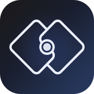
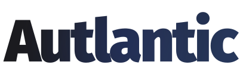

<p align="center">
  
</p>

<h1 align="center">Autlantic Payments SDK</h1>

<p align="center">
  <strong>USDC recurring billing on Base</strong><br />
  TypeScript SDK for subscriptions, invoices, webhooks, and sandbox testing.
</p>

<p align="center">
  <a href="https://docs.autlantic.com"></a>
  <a href="https://www.npmjs.com/package/@autlantic/payments-recurring"></a>
  <a href="LICENSE"></a>
  <a href="https://autlantic.com"></a>
</p>

<p align="center">
  
</p>

---

## Why this SDK

Autlantic Billing is the same engine that powers [Autlantic](https://autlantic.com) creator memberships:

- Recurring **USDC** charges on **Base**
- Direct settlement to the merchant `payoutAddressEvm` (Autlantic does not custody subscription revenue)
- Typed Node client, signed webhooks, and an in-process sandbox
- Optional hosted HTTP API for non-Node stacks

## Quick start

```bash
npm install @autlantic/payments-recurring
```

Requires **Node.js 20+**.

```ts
import { AutlanticBilling } from "@autlantic/payments-recurring";

const billing = AutlanticBilling.sandbox({ merchantId: "mer_demo" });

const { subscription } = await billing.createSubscription({
  merchantRef: "order_123",
  customerWallet: "0x742d35Cc6634C0532925a3b844Bc9e7595f0bEb0",
  payoutAddressEvm: "0xYourMerchantWallet",
  amountUsdc: 20,
  interval: "month",
});

// Completes the mandate and charges the first open invoice.
const { charge } = await billing.activateSubscription(subscription.id);

if (charge?.invoice.status === "paid") {
  // Unlock access for your customer
}
```

Full guides: [docs.autlantic.com](https://docs.autlantic.com)

## Packages

| Package | Description |
|---------|-------------|
| [`@autlantic/payments-recurring`](./packages/payments-recurring) | Merchant client: subscriptions, invoices, refunds, webhooks |
| [`@autlantic/payments-recurring-core`](./packages/payments-recurring-core) | Shared types, intervals, retry policy |
| [`@autlantic/chain-evm`](./packages/chain-evm) | Base + USDC + vault helpers |
| [`@autlantic/billing-engine`](./packages/billing-engine) | Subscription and invoice engine |

Most integrators only need `@autlantic/payments-recurring`.

## Features

- **Sandbox first** – `AutlanticBilling.sandbox()` for local demos without mainnet funds
- **Hosted or in-process** – call your billing API, or run the engine in memory for tests
- **Webhooks** – HMAC `x-autlantic-signature` with helpers to sign, verify, and parse events
- **Idempotent writes** – SDK sends `Idempotency-Key` on POST requests to the hosted API

## Documentation

| Resource | Link |
|----------|------|
| Getting started | https://docs.autlantic.com/guide/getting-started |
| Node.js API | https://docs.autlantic.com/api/nodejs |
| Hosted HTTP API | https://docs.autlantic.com/api/http |
| Webhooks | https://docs.autlantic.com/guide/webhooks |
| Security | [SECURITY.md](./SECURITY.md) |
| Publishing | [PUBLISHING.md](./PUBLISHING.md) |

## Develop in this repo

```bash
pnpm install
pnpm check      # build + test all packages
pnpm example    # sandbox demo
pnpm dev:docs   # local VitePress docs
```

## Security

Please report vulnerabilities privately. See [SECURITY.md](./SECURITY.md).

## Brand

Autlantic marks in [`brand/`](./brand) are for Autlantic documentation and approved partners. Do not use the Autlantic name or logo in a way that implies endorsement without permission. See [SECURITY.md](./SECURITY.md#brand-and-trademarks).

## License

This software is licensed under the [MIT License](./LICENSE).

Copyright © 2026 Autlantic. All rights reserved for trademarks and brand assets; the MIT License covers the source code in this repository.

## Links

- Product: [autlantic.com](https://autlantic.com)
- Docs: [docs.autlantic.com](https://docs.autlantic.com)
- npm: [@autlantic/payments-recurring](https://www.npmjs.com/package/@autlantic/payments-recurring)
- Support: [support@autlantic.com](mailto:support@autlantic.com)
