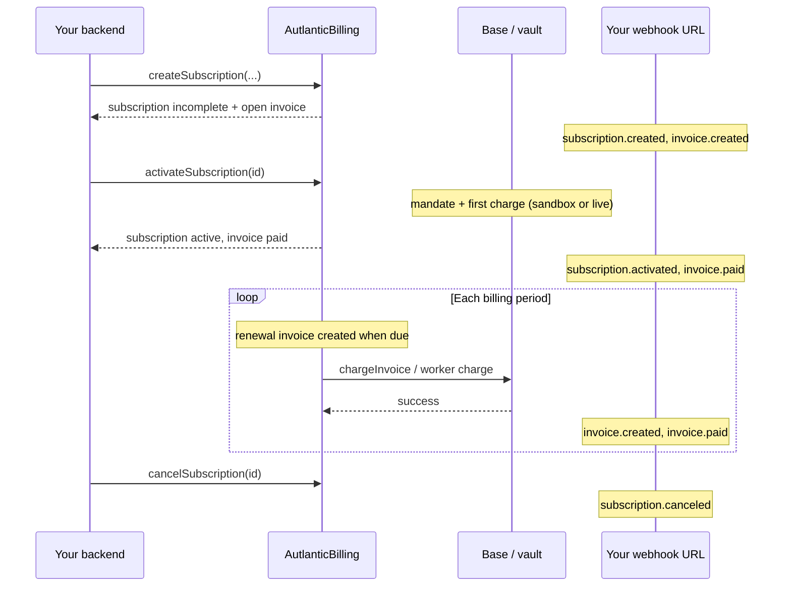
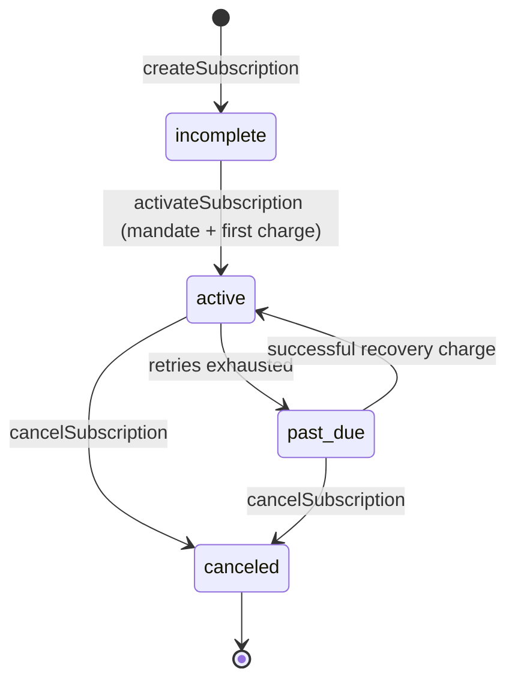
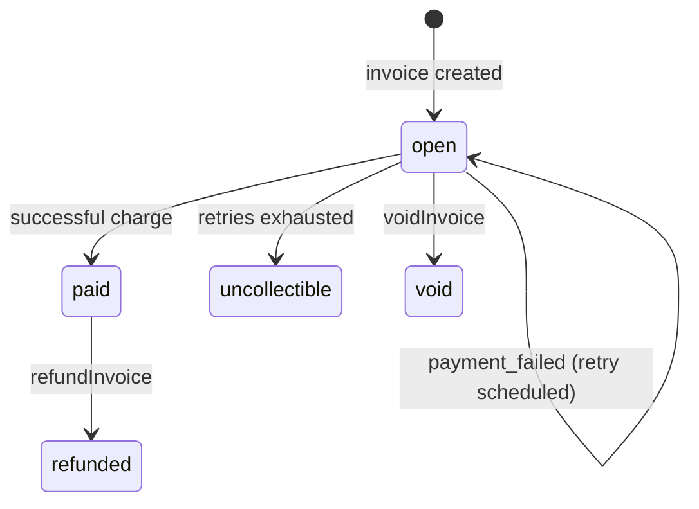

# Lifecycle

How a USDC subscription moves from create → activate → renew → fail/retry → cancel, and which webhooks fire.

## Happy path

## Subscription state machine

## Invoice status flow

## First charge vs renewals

| Step | API | Charges? |
|------|-----|----------|
| Create | `createSubscription` | No. Opens first invoice. |
| Activate | `activateSubscription` | **Yes.** Completes mandate and pays the first open invoice. |
| Complete only | `completeSubscription` | No. Mandate only; you charge later. |
| Renewal | `chargeInvoice` or Autlantic worker | Yes, for later open invoices. |

Do **not** call `chargeInvoice` on the same invoice immediately after a successful `activateSubscription`.

## Webhook timeline (typical)

| Order | Event | Meaning |
|-------|-------|---------|
| 1 | `subscription.created` | Incomplete subscription stored |
| 2 | `invoice.created` | First (or renewal) invoice opened |
| 3 | `subscription.activated` | Mandate active after activate |
| 4 | `invoice.paid` | Charge succeeded |
| — | `invoice.payment_failed` | Charge failed; see [retries](/guide/retries) |
| — | `subscription.past_due` | Automatic retries exhausted |
| — | `subscription.updated` | Plan / amount / metadata changes |
| — | `invoice.refunded` / `invoice.voided` | Money returned or invoice canceled |
| — | `subscription.canceled` | Subscription ended |

Full verify guide: [Webhooks](/guide/webhooks).

## Related

- [Getting started](/guide/getting-started)
- [Error codes](/guide/errors)
- [Retries](/guide/retries)
- [TypeScript types](/api/types)
